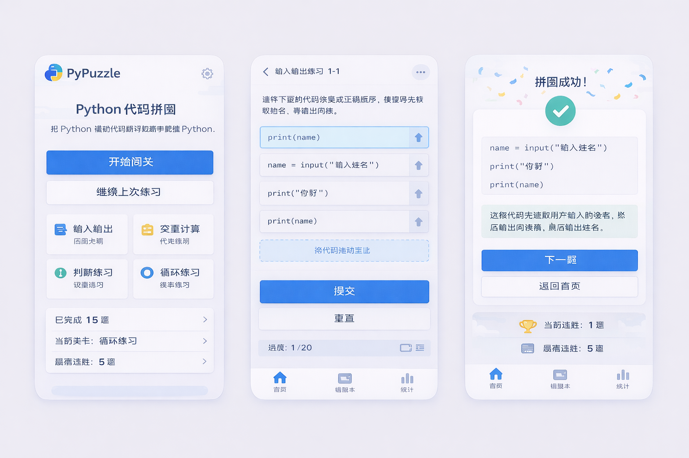

<div align="center">

# PyPuzzle Lite
### Python 代码拼图闯关


</div>

把打乱顺序的 Python 代码行拖回正确位置，用游戏化方式练执行顺序、缩进和语法结构。



## 项目亮点

- 20 道练习题，覆盖输入输出、变量、判断、循环
- 拖拽排序 + 即时判题反馈
- 错题记录、分类进度、连胜统计
- 自动保存学习状态（`localStorage`）
- 纯前端实现，双击即可运行

## 快速开始

1. 克隆仓库或下载源码
2. 直接打开 `index.html`

也可以用本地静态服务启动：

```bash
python -m http.server 8000
```

浏览器访问 `http://127.0.0.1:8000`

## 目录结构

```text
.
├─ index.html       # 页面结构
├─ style.css        # 样式
├─ data.js          # 题库与分类数据
├─ puzzle.js        # 拼图引擎（打乱、移动、校验）
├─ storage.js       # 本地存档
├─ app.js           # 页面交互与状态管理
└─ docs/preview.png # README 预览图
```

## 适合谁

- Python 初学者
- 培训班/课堂互动练习
- 想用小游戏巩固基础语法的学习者

